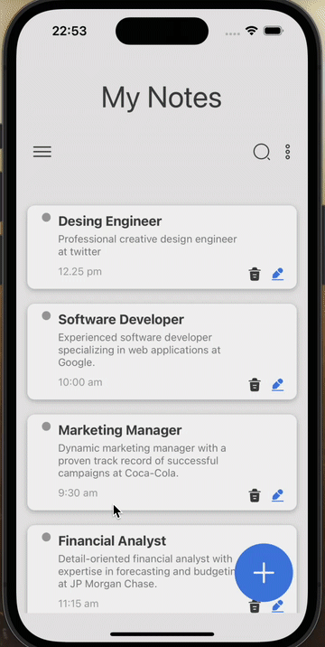
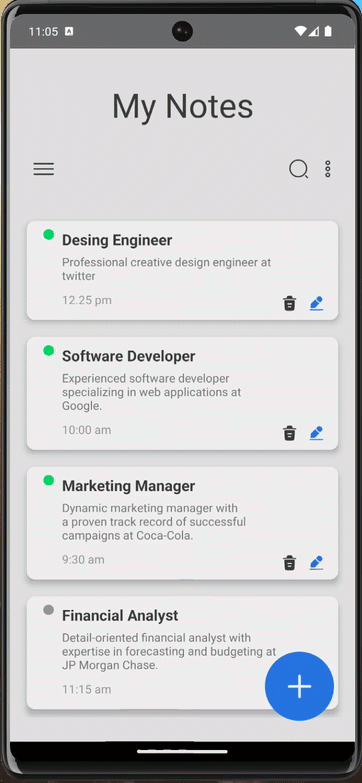

<h1> MyNotes-App </h1>

- Projemizin temeli olusturulan componentler ile olusturulmustur.
- Sayfa gecisleri React native navigation ile saglanmistir.
- Proje useState, useEffect (yasam dongusu) ve useContext hooklari kullanilarak gelistirilimistir.
- Basit ve kullanisli bir uygulamadir.
- Yeni not ekleme, notlari silme, duzenleme ve okundu bilgisi ile kullanici destekli bir uygulamadir.
- IOS ve Andriod mobil isletimlerine uygun olarak tasarlanmistir.
- Gelistirilebilir bir projedir.

<h2> IOS Screenshot </h2>

<h2> Android Screenshot </h2>

